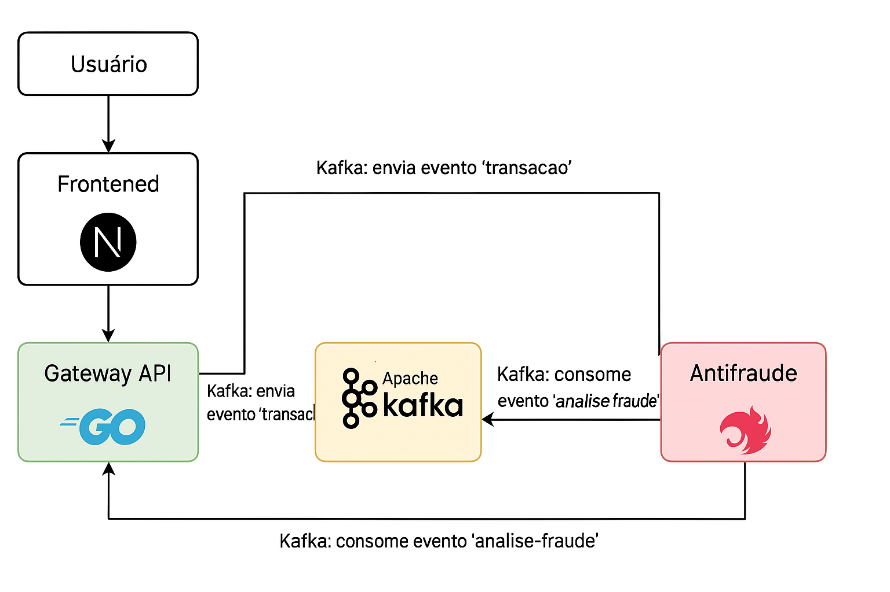

# 💳 Gateway de Pagamentos


<p align="center">
  
  
  
  
</p>


**Uma solução moderna para processamento de pagamentos com análise antifraude em tempo real!**  
Desenvolvido com Go, Next.js, NestJS, Kafka e PostgreSQL. 🔥

<p align="center">
  
</p>

---

## 🚀 Descrição

Este projeto simula um fluxo real de **gateway de pagamentos**.  
Nele, um cliente pode:
- Criar contas
- Consultar saldo
- Processar pagamentos
- Passar por um serviço de **análise antifraude** baseada em eventos Kafka antes da aprovação.

O objetivo é demonstrar **boas práticas de arquitetura de microsserviços**, **comunicação assíncrona** e **segurança de transações**.

---

## 🛠️ Tecnologias Utilizadas

<p align="center">
  
  
  
  
  
</p>

---

## 📦 Estrutura do Projeto

```
├── cmd/                # Main application entry point
├── internal/
│   ├── domain/         # Entidades e regras de domínio (Account)
│   ├── repository/     # Persistência de dados (PostgreSQL)
│   ├── service/        # Regras de negócio (AccountService)
│   ├── web/
│       ├── handlers/   # Camada HTTP
│       ├── server/     # Inicialização do servidor web
├── migrations/         # Scripts SQL para o banco
├── docker-compose.yml  # Orquestração de containers
├── README.md
```

---

## 🔄 Fluxo de Funcionamento

<p align="center">
  
</p>

1. **Usuário** envia uma requisição para criar ou consultar uma conta via API.
2. **Gateway API** gerencia a conta e publica eventos no Kafka.
3. **Serviço de Antifraude** consome e analisa os eventos.
4. **Decisão de fraude** retorna via Kafka para o Gateway.
5. **Usuário** recebe resposta do status da transação.

---

## 🐳 Docker Compose

Suba todo o ambiente local com apenas:

```bash
docker-compose up -d
```

Isso iniciará:
- PostgreSQL
- Kafka (em configuração separada)

*Scripts de migração SQL incluídos em `/migrations` para criar as tabelas necessárias.*

---

## 🧪 Teste a API

Exemplos de testes com client HTTP:

### Criar Conta

```http
POST http://localhost:8080/accounts
Content-Type: application/json

{
  "name": "John Doe",
  "email": "john@doe.com"
}
```

### Consultar Conta

```http
GET http://localhost:8080/accounts
X-API-Key: <sua-api-key-recebida-na-criação>
```

*(Arquivos de testes automáticos incluídos.)*

---

## 🛡️ Segurança

- Todas as APIs utilizam **autenticação via X-API-Key** nos headers.
- Controle de concorrência nas atualizações de saldo (`SELECT FOR UPDATE`).
- Manipulação de erros centralizada e padronizada.

---

## ✅ Status do Projeto

| Componente | Status |
|:-----------|:------:|
| Frontend (Next.js) | ✅ Finalizado |
| Gateway API (Go) | ✅ Finalizado |
| Apache Kafka | ✅ Configurado |
| Antifraude (Nest.js) | ✅ Finalizado |
| Docker Compose | ✅ Finalizado |
| Migrations SQL | ✅ Finalizado |
| Testes de API | ✅ Finalizado |

---

## 📄 Licença

Distribuído sob a licença **MIT**.  
Veja o arquivo [LICENSE](LICENSE) para mais informações.

---

✨ Desenvolvido por
Feito com 💙 por Viviane Aguiar

<p align="center"> <a href="https://www.linkedin.com/in/vivianezzt/" target="_blank">  </a> &nbsp; <a href="https://www.instagram.com/vivianezzt/" target="_blank">  </a> </p>

---
